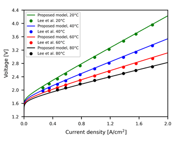

# Simulador de celda H 0D (v2)

> Nucleo numerico, CLI y GUI para estudiar curvas V-j de un electrolizador tipo H con configuracion YAML, doble electrodo y trazabilidad completa.

## Contenido rapido

- [Panorama](#panorama)
- [Requisitos e instalacion](#requisitos-e-instalacion)
- [Estructura del repositorio](#estructura-del-repositorio)
- [Flujos principales](#flujos-principales)
- [Configuracion YAML](#configuracion-yaml)
- [CLI v2](#cli-v2)
- [Interfaz web (Dash)](#interfaz-web-dash)
- [Datos de ejemplo y calibracion](#datos-de-ejemplo-y-calibracion)
- [Pruebas automatizadas](#pruebas-automatizadas)
- [Validacion y trazabilidad](#validacion-y-trazabilidad)
- [Documentos y diagrama](#documentos-y-diagrama)
- [Pasos siguientes sugeridos](#pasos-siguientes-sugeridos)

## Panorama

La version v2 reemplaza el foco de ORR/DFT de la v1 por un simulador 0D completamente parametrizable para una celda H:

- Curva de polarizacion estacionaria `V_cell = V_rev + eta_act + eta_ohm + eta_conc`.
- Electrodos A/B independientes con modelos Tafel o Butler-Volmer y dependencia Arrhenius de `j0`.
- Capas ohmicas en serie (membrana, electrodos, electrolito) y resistencia extra configurable.
- Modulo opcional de perdidas por concentracion via `j_lim` directo o parametros de difusion.
- Export de resultados y trazabilidad en CSV + grafico PNG desde la CLI y visualizacion interactiva en Dash.
- Validacion contra datos experimentales (`exp_data.csv`) con calculo de RMSE/MAE.

## Requisitos e instalacion

- Python 3.10+ (probado en Windows 11 con PowerShell).
- Pip actualizado: `python -m pip install --upgrade pip`.
- Dependencias: `pip install -r interfaz_usuario/requirements.txt` (incluye dash, pandas, numpy, matplotlib, pyyaml).

Sugerido preparar un entorno virtual:

```powershell
python -m venv .venv
.venv\Scripts\activate
pip install -r interfaz_usuario/requirements.txt
```

## Estructura del repositorio

- `simulador/`: nucleo 0D. `config_v2.py` define el parser YAML, `simulation_v2.py` evalua cada punto y conserva `EquationStep`.
- `cli_v2.py`: interfaz por linea de comandos (lectura YAML, simulacion, graficos, validacion) que delega todo en `simulation_v2.py`.
- `interfaz_usuario/app.py`: aplicacion Dash v2 con controles para condiciones, electrodos, capas ohmicas (en SI: m y S/m), transporte y carga de CSV experimental. `run_gui.bat` abre la app en Windows.
- `examples/`: plantillas `config.yml` y `exp_data.csv`.
- `calibracion/`: curvas digitizadas (Lee 2022) a diferentes temperaturas para ajustar parametros.
- `outputs/`: carpeta destino donde la CLI escribe `simulacion*.csv`, `trazabilidad_*.csv`, `curvas.png` y archivos de validacion.
- Documentacion tecnica en `requerimientos*.md`, `definicion_final_de_ecuaciones_v2.md`, `simulador_celda_h_0D_config.md`, `documento_validacion.md` y `diferencias_v1_v2.md`.

## Flujos principales

### Flujo 1. Simulacion base por CLI

1. Copia `examples/config.yml` y ajusta las claves (ver seccion [Configuracion YAML](#configuracion-yaml)).
2. Ejecuta la CLI apuntando al YAML:
   ```powershell
   python cli_v2.py --config examples/config.yml --output-dir outputs
   ```
3. Se generan:
   - `outputs/simulacion.csv` con todos los puntos (mezcla de los electrodos definidos).
   - `outputs/simulacion_A.csv` y `outputs/simulacion_B.csv` cuando existen ambos electrodos.
   - `outputs/trazabilidad_A.csv` / `trazabilidad_B.csv` con el detalle ecuacion-por-ecuacion.
   - `outputs/curvas.png` con la superposicion de las curvas V-j.

### Flujo 2. Comparacion entre dos electrodos

1. Define los bloques `electrode_A` y `electrode_B` en el YAML (pueden ser dos materiales o dos juegos de parametros del mismo material).
2. Corre la CLI (mismo comando). Los CSV separados permiten analizar cada electrodo y el grafico `curvas.png` muestra ambas curvas por temperatura.
3. Desde la GUI puedes ver la curva delta `ΔV (B - A)` para cada temperatura, evaluar cual electrodo domina y ajustar parametros sobre la marcha.

### Flujo 3. Validacion con datos experimentales

1. Prepara un CSV con columnas `j_exp` y `V_exp` (ejemplo en `examples/exp_data.csv`).
2. Ejecuta:
   ```powershell
   python cli_v2.py --config examples/config.yml --output-dir outputs --with-experimental examples/exp_data.csv
   ```
3. La CLI interpola la curva simulada, calcula RMSE/MAE/max error y escribe:
   - `outputs/validacion_vs_exp.csv` (j_exp, V_exp, V_sim, error, T_sim).
   - `outputs/validacion_metrics.txt` con las metricas agregadas.
   - Mensaje en consola con el RMSE para trazabilidad rapida.

### Flujo 4. Exploracion interactiva en la interfaz web

1. Instala las dependencias y ejecuta `python interfaz_usuario/app.py` (o `run_gui.bat`).
2. En la seccion **Condiciones de operacion** define rango de j, lista de temperaturas y parametros termodinamicos (V_ref, deltaS, bandera Nernst).
3. En cada tarjeta de **Electrodo** selecciona el modelo cinetico, `j0_ref`, `Ea`, alphas (o `alpha_a/alpha_c` para BV) y habilita el electrodo B solo si lo necesitas.
4. En **Capas ohmicas** agrega/quita filas (`Agregar capa`) indicando espesores en metros y conductividades en S/m; la app convierte internamente a cm/S·cm para empatar al nucleo.
5. En **Perdidas por concentracion** activa `Incluir eta_conc` para poblar `j_lim` o sus parametros difusivos.
6. Usa **Datos experimentales** para arrastrar un CSV; la grafica V-j mostrara los puntos experimentales y la tabla indicara cuantas filas se cargaron.
7. Presiona **Simular**. El tablero muestra:
   - Curvas por electrodo y temperatura y, si hay dos electrodos, `ΔV(B-A)`.
   - Tabla con `electrode, T, j, V_cell, V_rev, eta_act, eta_ohm, eta_conc, r_total, modelo`.
   - Panel de trazabilidad: selecciona una fila y revisa cada `EquationStep` y sus valores.

## Configuracion YAML

El archivo `config.yml` sigue la especificacion detallada en `simulador_celda_h_0D_config.md`. Bloques principales:

- `project_name` y `units`: etiquetas organizativas.
- `operating_conditions`: `T_list`, `j_min`, `j_max`, `n_points`, `use_concentration_losses`.
- `thermo`: `V_ref`, `delta_s_ref` y (opcional) `delta_h_ref`, `T_ref`, `n`, `use_nernst`, presiones y actividad del agua.
- `electrode_A` y opcional `electrode_B`: `name`, `kinetic_model` (`tafel` o `butler-volmer`), `n`, `alpha` o `alpha_a/alpha_c`, `j0_ref`, `Ea`, `T_ref`.
- `ohmic`: lista `components` (cada una con `name`, `delta`, `kappa_ref`, `Ea_kappa`, `T_ref`) + `extra_resistance`.
- `mass_transfer`: `enabled`, `j_lim`, `Ea_jlim` o los parametros `D_eff`, `C_bulk`, `delta_dif`.

Fragmento tomado de `examples/config.yml`:

```yaml
operating_conditions:
  T_list: [298.15, 353.15]
  j_min: 0.01
  j_max: 1.5
  n_points: 60
  use_concentration_losses: true

electrode_A:
  name: "Ni-HER-Lee2022"
  kinetic_model: "tafel"
  alpha: 0.8
  j0_ref: 0.00234
  Ea: 40000
  T_ref: 353.15

ohmic:
  components:
    - name: "separador_Zirfon"
      delta: 0.046
      kappa_ref: 0.05
      Ea_kappa: 15000
  extra_resistance: 0.02

mass_transfer:
  enabled: true
  j_lim: 2.0
```

## CLI v2

```
python cli_v2.py --config <ruta_config> --output-dir <carpeta> [--with-experimental exp.csv] [--no-plot]
```

- `--config`: obligatorio, apunta a un YAML valido.
- `--output-dir`: carpeta donde se escriben CSV, PNG y metricas.
- `--with-experimental`: activa la comparacion (requiere CSV con `j_exp,V_exp`).
- `--no-plot`: omite `curvas.png` en ambientes sin display.

Internamente la CLI:

1. Valida el YAML via `simulador.config_v2.load_config`.
2. Llama a `run_simulation_v2`, que genera mallas de j/T y produce `PointResultV2` para cada electrodo.
3. Convierte los resultados en DataFrames (`pandas`) para exportar y, si aplica, interpola vs. experimento.
4. Invoca matplotlib para guardar la figura de curvas.

## Interfaz web (Dash)

- Ejecutable con `python interfaz_usuario/app.py`. Usa Dash + Bootstrap (`flatly`) y guarda los resultados en memoria (`dcc.Store`).
- Controles principales:
  - `Condiciones de operacion`: temperaturas, rangos de j, parametros termodinamicos y bandera de Nernst.
  - `Electrodo A/B`: selector de modelo, `j0_ref`, `Ea`, alphas, nombre y toggle para habilitar B.
  - `Capas ohmicas`: tabla editable (agregar/eliminar capas) mas campo de resistencia extra.
  - `Perdidas por concentracion`: toggle y campos `j_lim`, `Ea_jlim` o parametros difusivos.
  - `Datos experimentales`: componente `dcc.Upload` que valida encabezados comunmente usados.
- Resultados:
  - Grafica principal V-j + overlay experimental.
  - Grafica `ΔV(B-A)` cuando hay dos electrodos.
  - Tabla ordenable y seleccionable con todas las contribuciones.
  - Panel de pasos con la lista completa de ecuaciones por punto (`EquationStep` serializado a JSON).

## Datos de ejemplo y calibracion

- `examples/config.yml`: punto de partida con parametros inspirados en Lee 2022 (Ni foam). Incluye electrodos A/B, capas ohmicas y `j_lim`. Todos los espesores estan en metros y las conductividades en S/m, tal como espera la GUI.
- `examples/exp_data.csv`: curva sintetica usada para validar `--with-experimental`.
- `calibracion/lee_20C.csv`, `lee_40C.csv`, etc.: datos digitizados por temperatura para recalibrar `j0`, `Ea`, `kappa` y `j_lim`. Se pueden cargar en la GUI o procesar via CLI para ajustar errores.
- `outputs/` contiene una corrida completa (CSV, trazabilidad, grafico y metricas) que sirve como referencia de formato.

## Pruebas automatizadas

- `tests/test_arrhenius_kappa.py`: valida la implementacion de Arrhenius en `simulador/electrochemistry.py` comparandola contra la forma analitica `value_ref * exp(-Ea/R (1/T - 1/T_ref))`.
- `tests/test_model_validations.py`: reproduce el flujo completo a 20 °C (V_rev, eta_ohm, eta_act OER/HER) utilizando los mismos parametros del YAML y resolviendo Butler-Volmer como referencia externa.

Ejecuta la suite con:

```powershell
python -m unittest tests/test_arrhenius_kappa.py tests/test_model_validations.py
```

Los tests estan pensados para correr en Windows/PowerShell, pero funcionan igual en Bash si cambias el comando.

## Validacion y trazabilidad

- Cada `PointResultV2` guarda los `EquationStep` para `V_rev`, `eta_act`, `eta_ohm`, `eta_conc` y `V_cell`. La CLI los vuelca a `trazabilidad_*.csv` con columnas `electrode, T, j, step_name, expression, result, values`.
- En la GUI puedes seleccionar cualquier punto y visualizar la pila completa de pasos con los valores sustituidos, o copiar el JSON mostrado en `step-values`.
- `documento_validacion.md` y `verificacion_config_v2.md` documentan la correspondencia entre ecuaciones implementadas y los requisitos, util para auditorias o revisiones cientificas.

## Documentos y diagrama

- `requerimientosv2.md`: especificacion funcional completa de la version 0D.
- `definicion_final_de_ecuaciones_v2.md`: deduccion paso a paso de las ecuaciones y variables necesarias.
- `simulador_celda_h_0D_config.md`: tabla que mapea cada clave YAML con su significado fisico.
- `diferencias_v1_v2.md`: resumen del cambio de alcance respecto a la v1.
- `diagrama.svg`: arquitectura visual del sistema (nucleo Python, CLI, GUI, flujos de datos). Puede abrirse directo en el navegador o incluirse en reportes.

### Diagrama Mermaid

```mermaid
graph TD
    A[YAML config.yml<br/>(operating, thermo, electrodos, ohmic, mass)] -->|load_config| B(simulation_v2.py)
    A -->|valores por defecto| C[interfaz_usuario/app.py]
    C -->|run| B
    A -->|--config| D[cli_v2.py]
    D -->|ejecuta| B
    B --> E[[PointResultV2 + EquationStep]]
    E --> F[outputs/<br/>simulacion.csv,<br/>trazabilidad_*.csv,<br/>curvas.png]
    E --> G[GUI: tablas, graficas,<br/>detalle de ecuaciones]
    F --> H[(Validacion exp.<br/>RMSE/MAE)]
```

### Diagrama detallado (SVG)




### LSV experimental de paper Lee 2022


