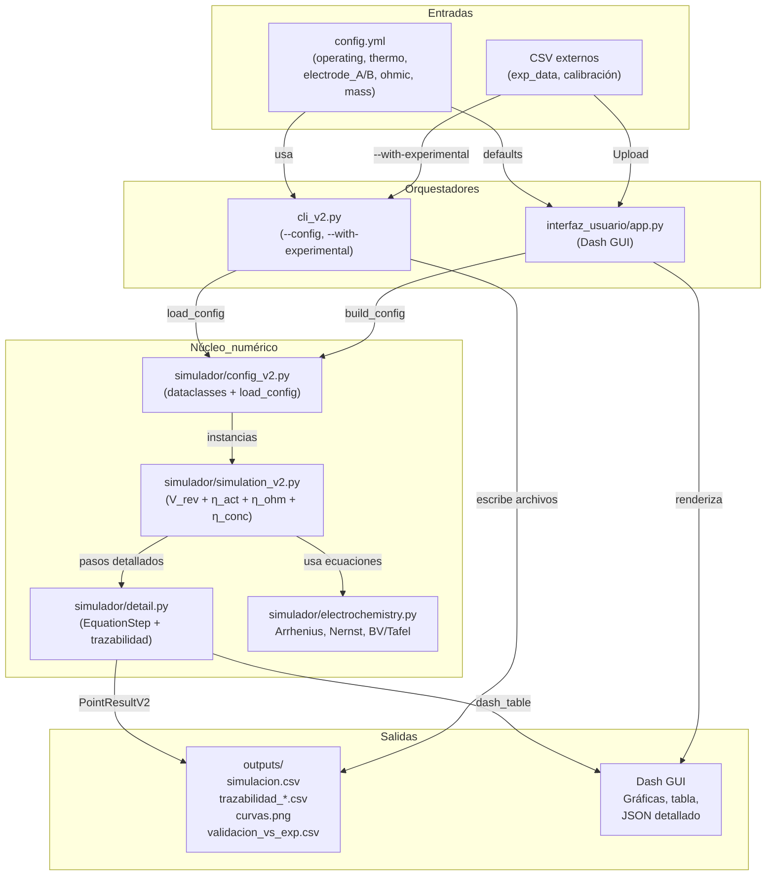

# Arquitectura y flujo de trabajo del simulador v2

El proyecto se organiza en tres capas principales (configuración + entradas, núcleo numérico y salidas/visualización) coordinadas por CLI y GUI. El siguiente diagrama Mermaid resume la interacción:

## Descripción de cada bloque

| Bloque | Descripción | Archivos clave |
| --- | --- | --- |
| Entradas | `config.yml` define todas las condiciones del experimento (rangos de j/T, termodinámica, parámetros cinéticos y óhmicos). Los CSV opcionales proporcionan datos experimentales o calibraciones. | `examples/config.yml`, `examples/exp_data.csv`, `calibracion/*.csv` |
| Orquestadores | La CLI (`cli_v2.py`) carga el YAML, ejecuta la simulación y exporta CSV/PNG; opcionalmente interpola frente a `exp_data.csv`. La GUI (`interfaz_usuario/app.py`) permite editar parámetros en vivo, cargar CSV y visualizar resultados interactivos. | `cli_v2.py`, `interfaz_usuario/app.py` |
| Núcleo numérico | `config_v2.py` transforma el YAML en dataclasses validadas. `simulation_v2.py` calcula V_rev + η_act + η_ohm + η_conc para cada punto, apoyándose en `electrochemistry.py` (Arrhenius, Nernst, Butler-Volmer) y registra cada paso en `detail.py`. | `simulador/config_v2.py`, `simulador/simulation_v2.py`, `simulador/electrochemistry.py`, `simulador/detail.py` |
| Salidas | La CLI guarda resultados en `outputs/` (CSV de simulación, trazabilidad por electrodo, curvas PNG, validación vs experimento). La GUI presenta tablas, gráficas, JSON con los `EquationStep` y permite inspeccionar cada punto. | `outputs/*`, componentes Dash en `interfaz_usuario/app.py` |

Este esquema sirve como referencia para entender qué módulo tocar cuando se ajusta un flujo: si cambias parámetros físicos, lo haces en el YAML; si necesitas otra forma de visualización, la capa de orquestadores consume exactamente los mismos `PointResultV2` producidos por el núcleo.
